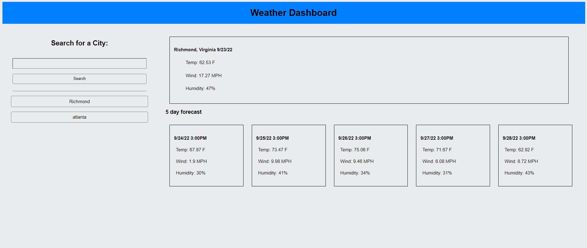

# weather-dashboard

## Description

This application displays the current and forecasted temperature, wind speed, and humidity of the location the user enters. It uses the Open Weather Geocoding API to find the latitude and longitude for the city the user enters or chooses from the search history. It then uses the Open Weather current weather data and 5 day weather forecast APIs to find the weather data at that latitude and longitude. The application then uses Javascript to display that data on the page. Everything the user enters is saved in local storage and displayed below the search bar

## Installation

N/A

## Usage

Enter the name of a city in the bar below "Search for a City:" and click on the search button. The weather data for the city entered will be displayed on the right side of the page and the text which the user entered will appear below the search bar where it can be clicked on to search for the same thing again. If the Geocoding API cannot find a city with the name the user entered, then an alert will appear saying so.

https://brendanshelton.github.io/weather-dashboard/

## Technologies used

HTML, CSS, Javascript, Open Weather API, Moment.js

## Credits

N/A

## License

MIT License

Copyright (c) 2022 BrendanShelton

Permission is hereby granted, free of charge, to any person obtaining a copy
of this software and associated documentation files (the "Software"), to deal
in the Software without restriction, including without limitation the rights
to use, copy, modify, merge, publish, distribute, sublicense, and/or sell
copies of the Software, and to permit persons to whom the Software is
furnished to do so, subject to the following conditions:

The above copyright notice and this permission notice shall be included in all
copies or substantial portions of the Software.

THE SOFTWARE IS PROVIDED "AS IS", WITHOUT WARRANTY OF ANY KIND, EXPRESS OR
IMPLIED, INCLUDING BUT NOT LIMITED TO THE WARRANTIES OF MERCHANTABILITY,
FITNESS FOR A PARTICULAR PURPOSE AND NONINFRINGEMENT. IN NO EVENT SHALL THE
AUTHORS OR COPYRIGHT HOLDERS BE LIABLE FOR ANY CLAIM, DAMAGES OR OTHER
LIABILITY, WHETHER IN AN ACTION OF CONTRACT, TORT OR OTHERWISE, ARISING FROM,
OUT OF OR IN CONNECTION WITH THE SOFTWARE OR THE USE OR OTHER DEALINGS IN THE
SOFTWARE.
